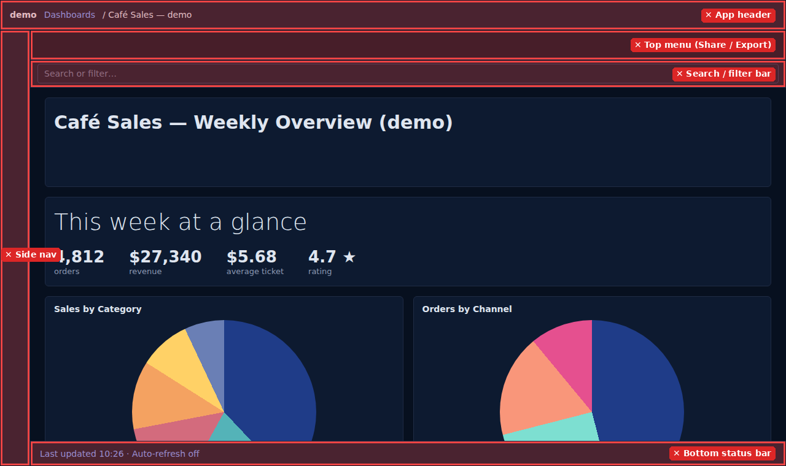
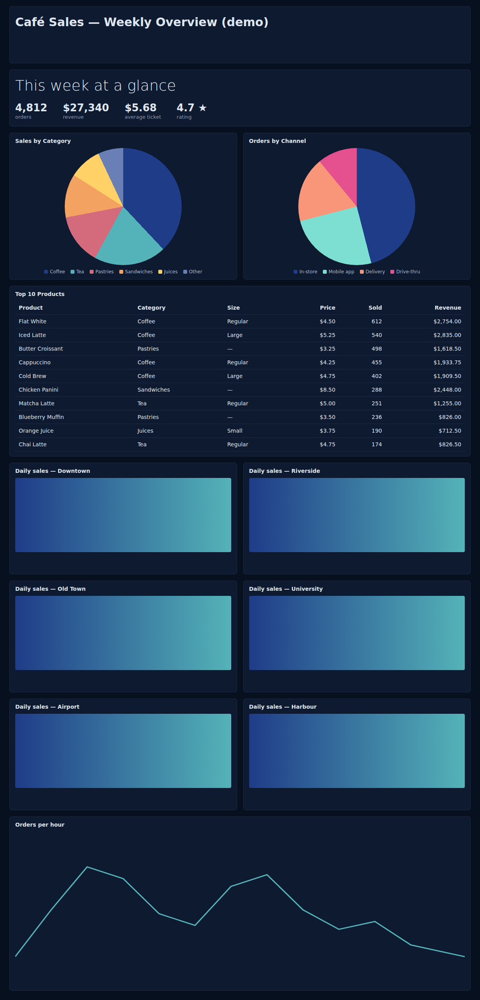
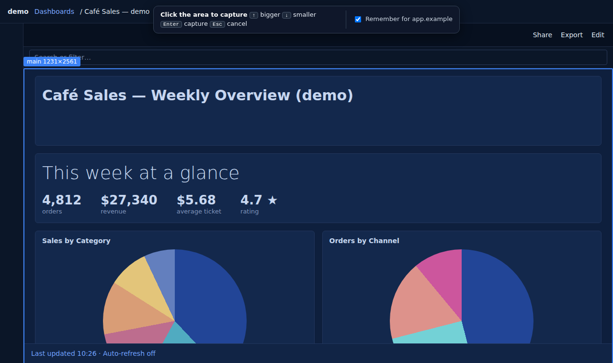
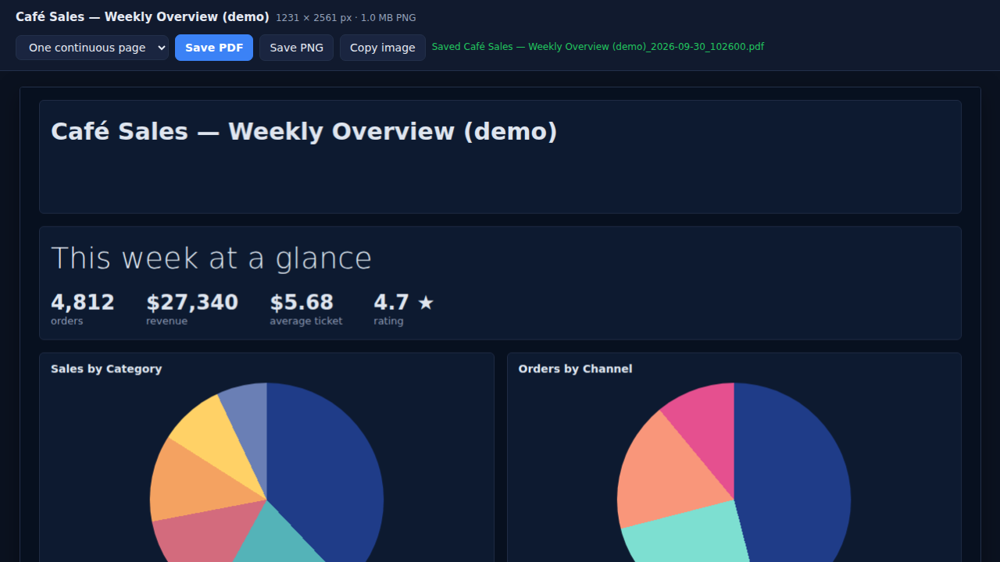
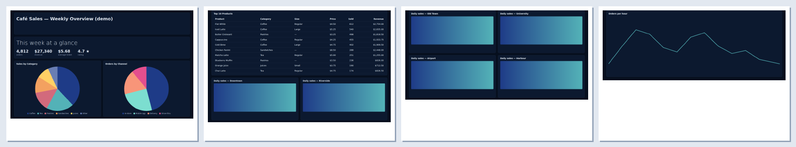
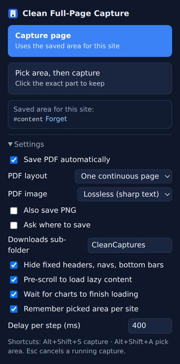
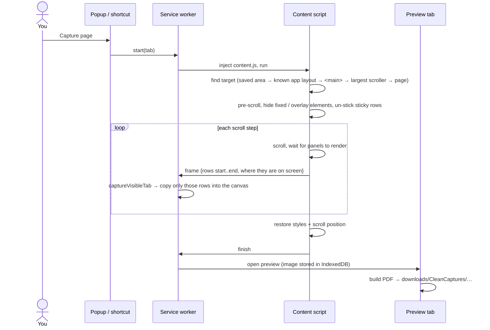

# Clean Full-Page Capture

A Chrome / Brave / Edge extension that takes a **full-page screenshot of just the content**, top to bottom, and saves it as a **PDF**:

- no browser UI: it captures the page viewport, never the screen (no tabs, URL bar, bookmarks or taskbar)
- no page chrome: fixed headers, side navs, toolbars and bottom bars are removed
- no duplicated strips: each scroll step copies only the rows that are new

Most full-page screenshot tools break on modern web apps (dashboards, admin panels, reports, documentation, web apps):

- The content scrolls inside an inner container instead of the window.
- Charts and panels only render once they're scrolled into view.
- Headers, navs and bars stay fixed on screen, so they repeat on every strip.

This extension handles all three, on any site.

<table>
  <tr>
    <th>What's on screen (red = removed)</th>
    <th>What you get</th>
  </tr>
  <tr>
    <td valign="top"></td>
    <td valign="top"></td>
  </tr>
</table>

---

## Features

- **Whole page, one file.** It scrolls the real scroll container (the window or an inner panel) and stitches the strips together.
- **No repeated strips.** Every strip is placed by its exact row position. The last scroll step, which normally repeats the bottom of the previous screen, only contributes the new rows.
- **Only the content.** Fixed and overlaying elements are hidden during capture, and sticky rows are un-stuck so they appear once. Everything is restored afterwards, including your scroll position.
- **Finds the content by itself.** In order, it uses:
  1. the area you picked for this site;
  2. the page's main content area (`<main>` / `role="main"`);
  3. the largest scrolling container;
  4. the whole page.
- **Waits for lazy content.**
  - Pre-scrolls so lazily loaded charts and panels render.
  - Before each shot, waits for standard loading markers (`aria-busy`, `data-render-complete`, common spinners).
  - A marker that never clears is skipped after one timeout, so it can't stall the capture.
- **Pick area.** Click the exact element to keep, press `↑`/`↓` to grow or shrink the selection, and it's remembered per site.
- **PDF out of the box.**
  - One continuous page, or A4 pages with page breaks moved into blank gaps (between cards, panels and sections).
  - Lossless or JPEG.
  - Unicode titles.
- **Sharp at any scaling.** Pixel-verified at 100 %, 125 %, 150 % and 200 % Windows display scaling.
- **Private by design.** Everything runs locally: there are no network requests, no analytics and no remote code (see [PRIVACY.md](PRIVACY.md)).

## Install

### From a release (recommended)

1. Download `clean-full-page-capture-vX.Y.Z.zip` from the **Releases** page (GitHub or GitLab).
2. *Optional:* verify the zip against `SHA256SUMS.txt`:
   ```powershell
   Get-FileHash .\clean-full-page-capture-v1.0.0.zip -Algorithm SHA256   # Windows
   sha256sum -c SHA256SUMS.txt                                          # Linux / macOS
   ```
3. Extract it to a permanent folder (e.g. `C:\Tools\clean-full-page-capture`).
4. Open `chrome://extensions` (Brave: `brave://extensions`, Edge: `edge://extensions`).
5. Enable **Developer mode**, click **Load unpacked**, and select the extracted folder.
6. Pin the extension from the puzzle-piece menu.

### From source

```bash
git clone <this repo>
```
Then **Load unpacked** the `extension/` folder. After you pull an update, click the reload ↻ icon on the extension card.

## Usage

| Action | How |
|---|---|
| Capture the page | Toolbar icon → **Capture page**, or `Alt+Shift+S` |
| Capture only one area | Toolbar icon → **Pick area, then capture**, or `Alt+Shift+A` |
| Grow / shrink the picked area | `↑` parent element · `↓` back to child |
| Confirm / cancel picking | Click or `Enter` · `Esc` |
| Cancel a running capture | `Esc` |

Keep the tab in front while it runs: browsers can only screenshot the visible tab. A page about ten screens tall takes around 10–20 s.



### Choosing exactly what's captured

**Capture page** picks the area automatically (see [Features](#features)). If the result includes something you don't want (a toolbar, a search bar), or misses something you do:

1. Use **Pick area** once.
2. Hover over the content and press `↑` / `↓` until the blue box covers exactly what you want. Press `↑` all the way to select the whole page.
3. Click.

With *Remember for this site* ticked, every later **Capture page** or `Alt+Shift+S` on that site reuses the area. **Forget** in the popup clears it.

## Output

When the capture finishes, a preview tab opens and the PDF is saved to `Downloads/CleanCaptures/<page title>_<YYYY-MM-DD_HHMMSS>.pdf`.

From the preview you can re-save the capture with a different layout, save a PNG, or copy the image.



**A4 layouts** fit the capture to the page width. Page breaks move into blank gaps, so charts, tables and cards aren't cut in half:



The PDF contains the image and two metadata fields: the page title and the creation date. There is no watermark and no tool branding.

## Settings



| Setting | Default | Notes |
|---|---|---|
| Save PDF automatically | on | Off = preview only; save manually |
| PDF layout | One continuous page | Or A4 landscape / A4 portrait |
| PDF image | Lossless | Sharp text. JPEG = smaller file |
| Also save PNG | off | |
| Ask where to save | off | Shows the Save-As dialog each time |
| Downloads sub-folder | `CleanCaptures` | Empty = straight into Downloads |
| Hide fixed headers, navs, bottom bars | on | |
| Pre-scroll to load lazy content | on | Many apps render charts and images only once they have been scrolled into view |
| Wait for charts to finish loading | on | Waits for `aria-busy`, `data-render-complete` and common spinners (max 10 s per step; markers that never clear are skipped) |
| Remember picked area per site | on | |
| Delay per step | 400 ms | Raise it if charts are caught mid-animation |

Keyboard shortcuts can be changed at `chrome://extensions/shortcuts`.

<br clear="right">

## How it works



Key details:

- **Target detection.** The order is: saved area → known app layout → `<main>` / `role="main"` → the largest scrolling container → the whole page.
  - "Known app layout" is a short built-in list of content-area selectors for apps whose layout needs a hint (`KNOWN_CONTENT_AREAS` in `content.js`); contributions welcome.
  - If `<main>` contains the real scroller, the scroller is used.
- **Absolute row placement.** The content script computes which *target rows* are new in each step, and the stitcher writes them at that exact row of the output. Overlapping or clamped scroll steps (the last one) can therefore never duplicate content.
- **Fractional scaling.** At 125 % or 150 % the browser snaps scroll offsets to device pixels. Each step overlaps by 1 CSS px, and rounding matches the browser's half-up paint snapping, so no sliver of rows is lost or repeated.
- **Overlay detection.** Before capturing, the content script hides:
  - `position: fixed` elements, unless a transformed ancestor makes them part of the content;
  - absolutely positioned elements that sit on top of the scroll container from outside it.

  Sticky elements inside the scroller are switched to `relative` for the duration.
- **PDF writer.** `extension/pdf.js` is a small dependency-free PDF 1.4 writer. It stores images Flate-compressed (lossless) or as JPEG.

## Permissions & privacy

| Permission | Why |
|---|---|
| `activeTab` | Access only the tab you click the button on (or use the shortcut on), only at that moment |
| `scripting` | Inject the capture script into that tab |
| `storage` | Your settings and remembered areas (CSS selector per host) |
| `downloads` | Save the PDF / PNG |

The extension makes no network requests and uses no remote code or analytics. The last 5 captures are kept in the extension's local IndexedDB so the preview tab can show them, and they're deleted when you uninstall. Details: [PRIVACY.md](PRIVACY.md) · Security reports: [SECURITY.md](SECURITY.md)

## Limitations

- Very tall pages (more than about 32 000 px at your scaling) are scaled down to fit the browser's canvas limit.
- Browser-internal pages (`chrome://`, the Web Store, the built-in PDF viewer) can't be captured by any extension.
- Iframes are captured as they appear on screen; their inner content isn't scrolled separately.
- Content that changes while scrolling (live-refreshing panels, auto-refresh) can differ between strips. Pause auto-refresh first.

## Development

Requirements: Node.js 20+ (22 recommended). The end-to-end tests use a bundled headless Chromium (Linux x64, e.g. WSL or CI). On other systems, set `CHROME_PATH`.

```bash
npm ci
npm run check     # syntax, manifest integrity, MV3 rules, repo hygiene (no secrets / real IPs)
npm test          # end-to-end: real content.js + stitch.js + pdf.js in headless Chromium
npm run package   # dist/clean-full-page-capture-vX.Y.Z.zip + SHA256SUMS.txt
```

`npm test` runs the real extension code against dashboard-like fixture pages (fixed header/nav/bottom bar, inner scroller, sticky row, lazily loaded panels) at 100/125/150/200 % scaling. It then checks the stitched image pixel by pixel:

- every row appears **exactly once, in order**;
- no header, nav, bottom-bar or overlay pixels leak into the capture;
- lazy panels are rendered;
- scroll position and page styles are restored;
- the PDFs are structurally valid, and the lossless PDF matches the PNG byte for byte.

It also covers target detection, loading markers (including one that never clears), the area picker, the remembered area, Esc-cancel, the preview tab and the popup. Useful options:

```bash
DPRS=1,1.25 npm test          # selected scaling factors
KEEP_OUTPUT=1 npm test        # keep captures + PDFs in tests/output/
```

### Project structure

```
extension/            the extension itself: load this folder unpacked
  manifest.json
  background.js       service worker: starts captures, grabs screenshots, opens the preview
  content.js          target detection, overlay hiding, scroll loop, area picker
  stitch.js           places screenshot slices into the output canvas
  pdf.js              dependency-free PDF writer
  viewer.html/.js     preview tab + auto-save
  popup.html/.js      toolbar popup + settings
  settings.js, db.js  shared settings, IndexedDB hand-off
tests/                end-to-end suite + fixture pages
scripts/              check.mjs, package.mjs
docs/                 images, PUBLISHING.md
.github/ .gitlab/     CI, issue and PR/MR templates
```

## Releasing

1. Bump `version` in **both** `extension/manifest.json` and `package.json`, and update `CHANGELOG.md`.
2. Commit, then tag and push, e.g. `git tag v1.0.1 && git push --tags`. See [docs/PUBLISHING.md](docs/PUBLISHING.md) for pushing to GitHub and GitLab together.
3. CI runs the checks and tests, builds the zip, and publishes a release with the zip and `SHA256SUMS.txt`:
   - **GitHub:** a GitHub Release.
   - **GitLab:** a GitLab Release plus a Generic Package.

The pipeline refuses a tag that doesn't match the manifest version.

## License

[MIT](LICENSE)
